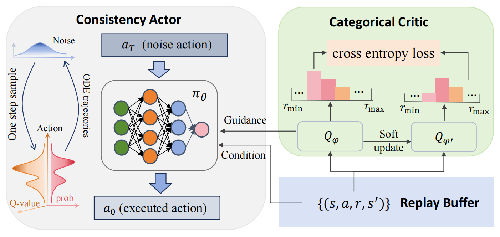

# Consistency Policy with Categorical Critic for Autonomous Driving

Code for "Consistency Policy with Categorical Critic for Autonomous Driving", AAMAS 2025 paper.

# Introduction

We introduce Consistency Policy with Categorical Critic (CPCC), which leverages recent advancements in diffusion models, particularly consistency models, to serve as the actor, enabling the representation of multimodal action distributions. Additionally, we utilize classification loss (cross-entropy loss) for training the categorical critic, which mitigates overfitting to noisy targets and yields more accurate Q-value approximations.



# Quick Start

1. Setting up repo

```bash
git clone https://github.com/weiaiF/cpcc
```

2. Install Dependencies

```bash
conda create -n cpcc python=3.7
conda activate cpcc
cd cpcc
pip install -r requirements.txt
```
3. Train

```bash
sh train_cpcc.sh
```

# Acknowledgement
CPCC is greatly inspired by the following outstanding contributions to the open-source community:
[CPQL](https://github.com/cccedric/cpql), [MetaDrive](https://github.com/metadriverse/metadrive)
